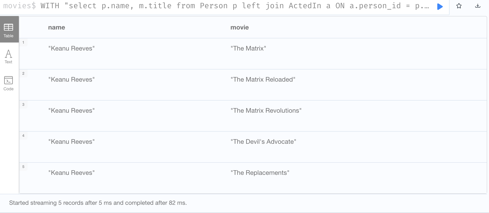
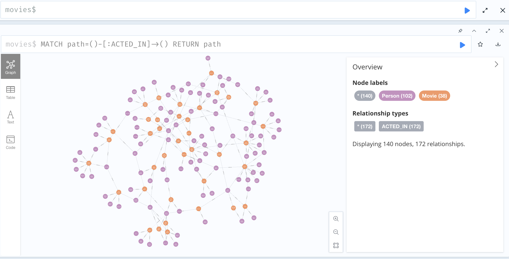

# Neo4j load data from SQLServer with APOC

## Run

The Docker compose file includes SQL Server and Neo4j.

Run the compose file : 

```bash
docker compose up -d
```

Run the following command to initialise the tables in SQL Server ( it creates the movies graph but as tables :) )

```bash
docker exec -it sqlserver /opt/mssql-tools18/bin/sqlcmd -S localhost -U sa -P "npaEzszSALRH5q56372zGJ" -C -i /sql/init.sql
```

Go to the Neo4j browser on http://localhost:7474 and login with `neo4j/password`.

Query data from the SQL database : 

```cypher
WITH 
"select p.name, m.title 
from Person p 
left join ActedIn a ON a.person_id = p.id 
left join Movie m ON m.id = a.movie_id " 
AS sql
CALL apoc.load.jdbc(
    'jdbc:sqlserver://sqlserver:1433;databaseName=movies;user=sa;password=npaEzszSALRH5q56372zGJ;encrypt=false',
    sql, []
) YIELD row
RETURN row.name AS name, row.title AS movie
LIMIT 5
```


The jdbc connection url is aliased in the `apoc.conf` file : 

```text
apoc.jdbc.movies.url=jdbc:sqlserver://sqlserver:1433;databaseName=movies;user=sa;password=npaEzszSALRH5q56372zGJ;encrypt=false
```

And thus all procedure calls can be used using the `movies` alias insteead : 

```cypher
CALL apoc.load.jdbc('movies', 'select top 5 name from Person', [])

╒════════════════════════════╕
│row                         │
╞════════════════════════════╡
│{name: "Keanu Reeves"}      │
├────────────────────────────┤
│{name: "Carrie-Anne Moss"}  │
├────────────────────────────┤
│{name: "Laurence Fishburne"}│
├────────────────────────────┤
│{name: "Hugo Weaving"}      │
├────────────────────────────┤
│{name: "Lilly Wachowski"}   │
└────────────────────────────┘
```

Create the `movies` database and switch to it : 

```cypher
CREATE DATABASE movies WAIT;
```

```cypher
:USE movies
```

Create the constraints and indexes

```cypher
CREATE CONSTRAINT FOR (n:Person) REQUIRE n.id IS NODE KEY;
CREATE CONSTRAINT FOR (m:Movie) REQUIRE m.id IS NODE KEY;
CREATE CONSTRAINT FOR (n:Person) REQUIRE n.name IS :: STRING;
CREATE CONSTRAINT FOR (n:Person) REQUIRE n.born IS :: DATE;
CREATE CONSTRAINT FOR (m:Movie) REQUIRE m.title IS :: STRING;
CREATE CONSTRAINT FOR (m:Movie) REQUIRE m.released IS :: DATE;
CREATE FULLTEXT INDEX Person FOR (n:Person) ON EACH [n.name];
CREATE FULLTEXT INDEX Movie FOR (m:Movie) ON EACH [m.title];
```

Load the `Person` table from SQLServer and create `Person` nodes : 


```cypher
CALL apoc.load.jdbc(
    'movies',
     'Person'
) YIELD row
MERGE (n:Person {id: row.id})
SET n.name = row.name
SET n.born = date(row.born);
```

Load the `Movie` table from SQLServer and create `Movie` nodes : 

```cypher
CALL apoc.load.jdbc(
    'movies',
     'Movie'
) YIELD row
MERGE (n:Movie {id: row.id})
SET n.title = row.title
SET n.tagline = row.tagline
SET n.released = date(row.released);
```

Load the `ActedIn` table from SQLServer and create the `ACTED_IN` relationships : 

```cypher
CALL apoc.load.jdbc(
    'movies',
     'ActedIn'
) YIELD row
MATCH (n:Person {id: row.person_id})
MATCH (m:Movie {id: row.movie_id})
MERGE (n)-[:ACTED_IN]->(m);
```

Verify : 

```cypher
MATCH path=()-[:ACTED_IN]->()
RETURN path
```

